# 2025-04-19

## 🏁 已完成

1. 早起吃早餐，然后再散步回家
2. 搭建了一个属于自己的网站（虽然还没发布），用于记录自己的学习过程和知识。
3. 学习了一些新的技术，包括：
   - 了解 live2d 技术在 web 中的应用，并在 rspress 中使用 live2d 实现看板娘功能
   - 了解了如何编写 rspress 插件，用于扩展 rspress 的功能

## 📖 知识

### 1. markdown table 换行

今天在用 rspress 写 markdown 表格的时候，发现不是所有 markdown 渲染器 都支持解析 table 时夹杂 HTML 标签。

rspress 解析 md/mdx 时是使用 @rspress/mdx 插件，而 @rspress/mdx 就是 @mdx-js/mdx 的 rust 重构的版本。那么可能类 @mdx-js/mdx 的库都不支持解析 table 时夹杂 HTML 标签。

通用的解决方案：

**用空白的单元格来填充示意它和之前的单元格是同一个值**

```md
| 姓名 | 简介                       |
| ---- | -------------------------- |
| 张三 | 这是张三的简介。           |
|      | 他是一个优秀的软件工程师。 |
| 李四 | 这是李四的简介。           |
|      | 他热爱开源技术。           |
```

### 2. rspress auto navbar

我制作应用时用了 trae ，他在生成 rspress 的导航栏时，用的 rspress.config.ts，结果导致项目无法自动生成侧边导航栏。后面根据官网的说法：

**_在 rspress.config 里配置了导航栏会阻止 rspress 根据 \_meta.json 自动生成侧边导航栏_**

## 💖 感悟

感觉自己一整天都在薅牛毛，从单纯做笔记，到突发奇思妙想用 rspress 去渲染 markdown（用这个来写的笔记）。

在翻看 rspress 的文档时，发现 rspress 还可以用 live2d 看板娘，于是就开始捣鼓这个 rspress-plugin-live2d 插件，结果发现这个插件许久没更新了，使用有问题，于是就放弃了这个插件，选择了自己编写 rspress 的 live2d 的插件，实现完之后萌生出一个想法，我得把这个写成文档记录下来

import { Steps } from "rspress/theme";

    <Steps>
      ### 第 1 步

     做笔记

      ### 第 2 步

      用 rspress 去渲染笔记

      ### 第 3 步

      捣鼓 rspress-plugin-live2d

      ### 第 4 步

      编写 rspress 使用 live2d 的插件

      ### 第 5 步

      书写 md 记录今天收获的知识
    </Steps>

## 💡 创意

### 1. AI生成练习题

昨天刷题的时候老是记不住知识点，我思来想去觉得应该是没有对应的 练习题，于是我打算制作一个应用来生成练习题，可以专项练习。

#### 思路

```mermaid
flowchart TD
    1[用户提供资料] --> 2[AI 生成题目]
    2 --> 3[用户提交答案]
    3 --> 4[AI 批改答案]
    
```

