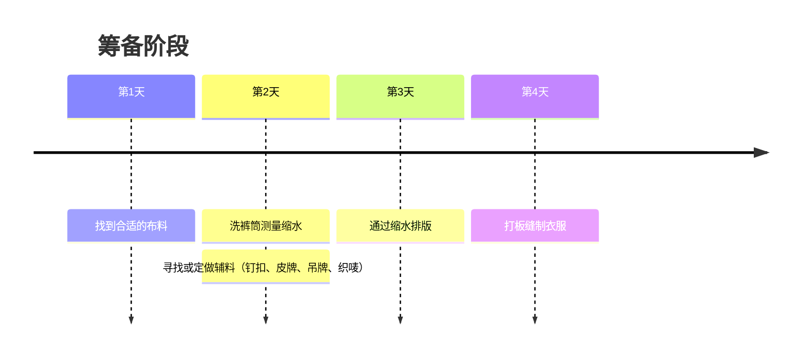
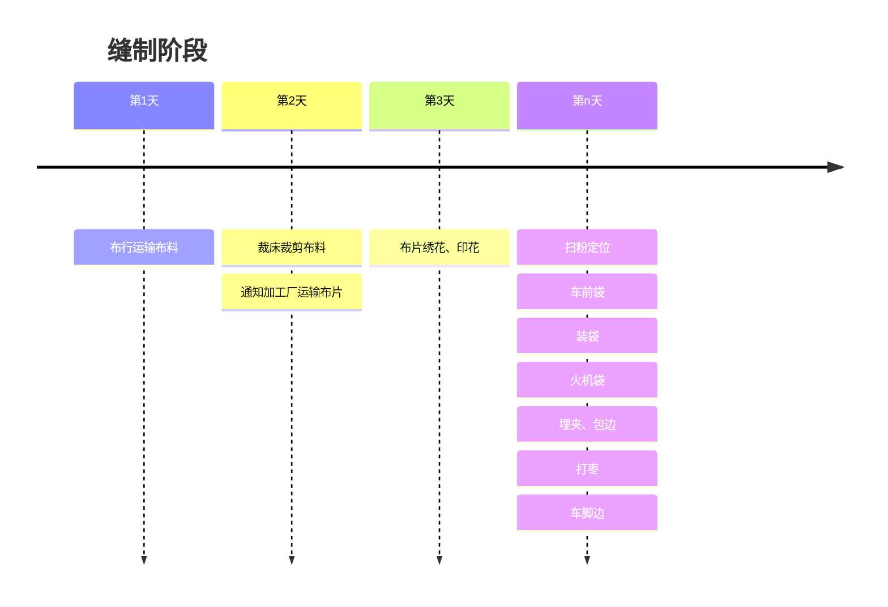

# 2025-04-24

## 👖 对于女装牛仔制衣厂的一些思考 —— 流程

### 筹备



### 缝制


### 水洗

```mermaid
timeline
    title 水洗阶段
    第1天: 通知水洗厂收取裤子
    第2天: 

``` 

### 销售

1. 线下
2. 线上

#### 线下

- 工厂批量直售
- 市场档口销售

|类型名|优势|缺点|
|-|-|-|
|工厂批量直售|成本相对较低|拉新困难|
|市场档口销售|成本较高|拉新较易|

#### 线上

- 平台商铺销售
- 营销带货

##### 平台商铺销售

1. 平台分析

对于牛仔厂家而言，淘宝、拼多多和京东三大平台的优劣势可从用户定位、运营成本、流量特征、售后服务及品牌塑造等角度进行对比分析，结合搜索结果内容综合如下：

---

**1. 淘宝：灵活性与流量优势，但竞争激烈**
**优势**  
- **用户基数庞大**：作为最早的综合电商平台，淘宝覆盖从低端到中高端的多元化消费者群体，适合牛仔厂家触达不同细分市场。  
- **商品多样性**：支持个性化设计与小众品牌孵化，尤其适合潮流牛仔或原创设计产品的推广。  
- **运营灵活性**：开店门槛低，商家可自主定价，且平台规则对中小商家较友好（如近期优化了“仅退款”政策，减少恶意退款风险）。  

**劣势**  
- **竞争白热化**：同类牛仔产品商家众多，需通过直通车、直播等高成本推广提升曝光率，运营成本较高。  
- **品质管控压力**：平台商品质量参差不齐，需厂家自行强化质检和售后服务以避免差评。  
- **物流依赖第三方**：配送速度和稳定性不如京东，可能影响消费者体验。

---

**2. 拼多多：低价走量利器，但利润空间压缩**
**优势**  
- **低价策略适配下沉市场**：拼多多以价格敏感型用户为主，适合低价牛仔产品（如基础款、库存清仓）快速走量，尤其在三线以下城市和农村市场渗透率高。  
- **社交裂变引流**：通过拼团、砍价等模式吸引用户主动分享，降低获客成本，适合需要快速铺货的厂家。  
- **平台补贴扶持**：近期推出“新质商家百亿扶持计划”，减免交易手续费，降低保证金等，短期可减轻商家负担。  

**劣势**  
- **利润空间有限**：低价定位导致产品溢价能力低，需依赖规模效应盈利，对成本控制要求极高。  
- **品质与售后争议**：平台“仅退款”政策偏向消费者，若商品质量或物流问题频发，易引发纠纷和资金损失。  
- **品牌形象限制**：长期低价标签可能影响中高端牛仔品牌形象，不利于长期品牌建设。

---

**3. 京东：品质与物流优势，但门槛较高**
**优势**  
- **品质背书与高消费力用户**：京东用户对价格敏感度较低，更关注商品质量和服务，适合中高端牛仔品牌或功能性产品（如高端丹宁、科技面料）。  
- **自营物流体系**：京东物流可实现次日达甚至当日达，提升消费者体验，尤其适合需快速周转的库存管理。  
- **售后服务保障**：退换货流程规范，平台介入纠纷较少，减少商家售后压力。  

**劣势**  
- **入驻门槛高**：对商家资质（如品牌授权、质检报告）要求严格，且自营模式需接受平台抽成，中小厂家进入难度大。  
- **运营成本高**：推广费用（如京东秒杀、品牌日）和物流仓储成本均高于其他平台，利润率可能被压缩。  
- **品类局限性**：服饰类目流量和用户活跃度低于3C家电，需结合平台流量扶持政策（如年货节专项补贴）提升曝光。

---

**综合建议**
- **目标市场与定位**：  
  - 低价走量 → **拼多多**（需强化品控与供应链）；  
  - 中高端/品牌化 → **京东**（借助物流与品质背书）；  
  - 多样化试水 → **淘宝**（灵活运营，结合直播或内容营销）。  
- **成本控制**：拼多多适合低成本快速扩张，京东需长期投入品牌建设，淘宝需平衡推广与利润。  
- **政策适配**：关注各平台最新惠商政策（如淘宝的“账号诚信体系”、拼多多的“百亿减免”），优化运营策略。

---

**风险提示**
- **拼多多**：需防范“仅退款”政策下的资金风险，建议优先选择平台认证的优质商家身份以获取更多支持。  
- **京东**：避免过度依赖自营流量，可尝试POP店模式降低门槛，同时参与平台年货节等大促活动提升销量。  
- **淘宝**：需持续优化商品详情页与评价管理，利用“退货宝”等工具降低售后成本。  
