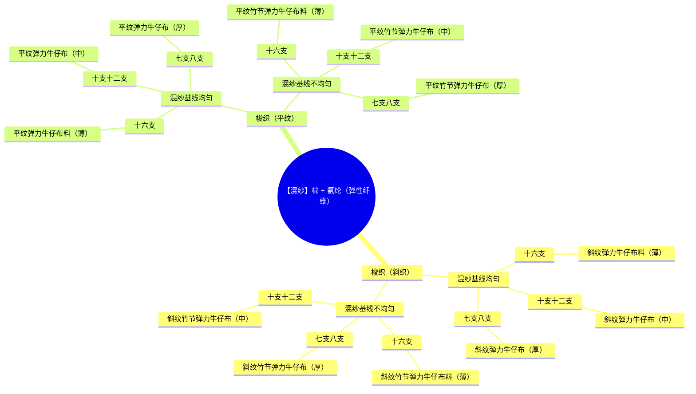

# 2025-05-02

## 📖 知识

### 1. 牛仔布料与 `织法`、`原料` 之间的关系

#### 织法
首先织法分为：

- 针织
- 梭织

由于针织的织法相较于梭织而言，结构不牢固，因此在牛仔布的设计上，通常会采用梭织而梭织又分为：

- 斜织
- 平织

#### 原料

牛仔布的原料通常是`纯棉`或者`混纺`。纯棉顾名思义。混纺则是以棉为主，再辅以其他化学纤维与天然纤维混合进行纺织。

1. 混入 氨纶 以增加布料整体弹性。
2. 混入 尼龙（锦纶）增强布料的强度。

:::tip 斜纹 与 平纹
`斜纹` 与 `平纹` 的区别在于：

- 斜纹：
  - 面料的线与线之间的角度

:::

### 2. 牛仔布料 RouteMap

以 **弹力牛仔** 为例：

