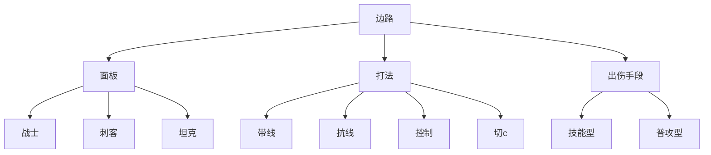
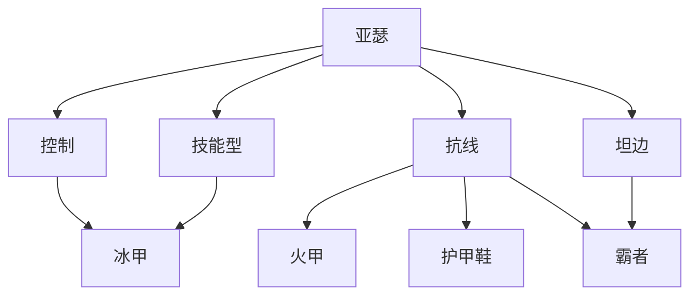
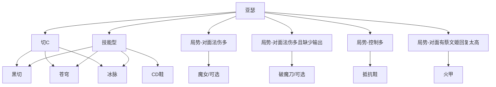

# 农活指南 - 出装篇

## 🏆结论（暴论）

import { Card } from "@theme";

<Card title="公式： 出装 = 英雄分类 + 局势分析" />

## 🚩英雄分类

"尺有所长，寸有所短"

Q: 我们为什么要分类？
A: 通过两种分类，可以量化英雄的 `输出装` 和 `防御装`

英雄有多种分类，装备也是如此。我们可以通过 打法和出伤和面板 决定英雄的攻击装与防御装。

::: warning
有些英雄，因为版本和本身英雄更新优化（增强或变弱）会直接改变英雄的打法，所以需要根据英雄的版本和英雄的更新情况来选择英雄的装备。
:::

### 面板

按照英雄面板分类，大致有三种

- 战士类：较为均很，血量攻击攻速相较于其他类型都更为均衡
- 刺客类：更高的攻击或者攻速成长和基础，较低的血量成长
- 坦克类：更高的血量成长和基础，较低的攻击或者攻速成长

::: tip
在之前版本的 ”统一度量衡“ 之后，大部分都满足这个
:::

### 打法

按照打法分类，大致有四种，英雄对于打法有重合，即一个英雄有多种打法

- 带线: 老夫子、暗信
- 抗线: 廉颇
- 控制: 廉颇
- 切C: 达摩

### 出伤手段（输出方式）

- 技能型
- 普攻型

## 🚩局势分析

“兵无常势，水无常形”

对局情况瞬息万变，出装自然也不是固定的。通过 “分析自身定位与团队需求，判断敌对方英雄特性与玩家水平” 来判断局势出装

己方：
 - 缺少控制应对对方 (团队)
 - 缺少输出 (团队)
 - 回复 (自己)
 - 兵线处理 (团队)
 - ......

 
敌对
 - 控制太多
 - 高额回复
 - ...... 

## 例子

"冰甲控制流-亚瑟"

"半肉切C流-亚瑟"

