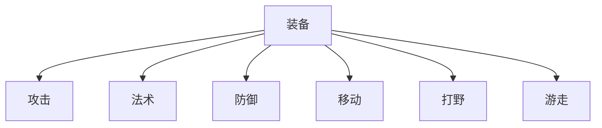
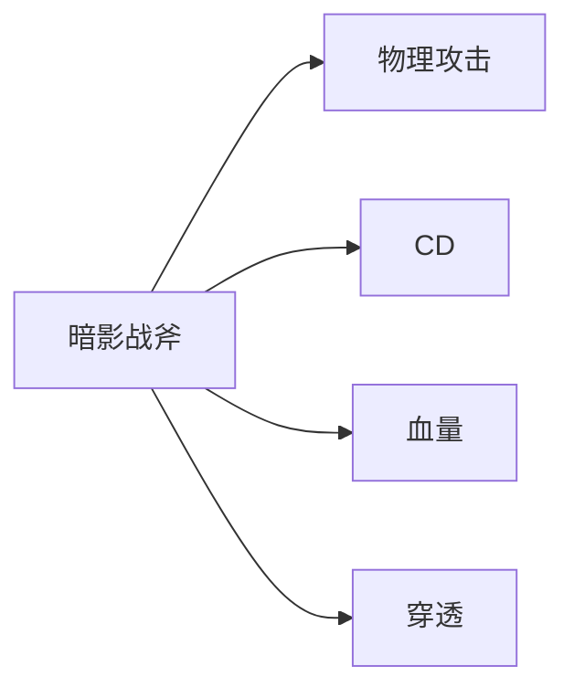

# 农活指南 - 装备篇

分析出装的基础是需要对装备以及英雄特性有所了解. 本篇介绍的是装备的分类与分析英雄特性选择合适的装备.

## 结论


## 装备分类

王者官方对于装备有八种, 其中六种可以在对局商店购买装备时看见:

- 攻击
- 法术
- 防御
- 移动
- 打野
- 游走

其余两个截至当前 2026-05-28 尚不出现在局内.

- 专精装
- 如愿法器



## 装备作用分类归纳

因为 “统一度量衡” 之后，角色差异化降低，很多同类型的角色开局面板相差无几。我们抛开粗略基础分类, 通过分析装备作用来进行标签分类，可以做到缺啥补啥。

- 物理攻击
- 法术攻击
- 吸血
- 攻速
- 暴击
- 发球(普通攻击附带特效)
- CD
- 物抗
- 移速
- 法抗
- 血量
- 控制
- 穿透
- 保命
- ......

### 例子

暗影战斧(黑切)


```
+80 物理攻击    (物理攻击)
+10% 冷却缩减   (CD)
+500 最大生命   (血量)
---------------------------------------------------------
唯一被动-切割: 增加 90-180 的物理穿透 (穿透)
```


抽象出装备 tag 之后，我们可以根据英雄需求和局势进行选择

