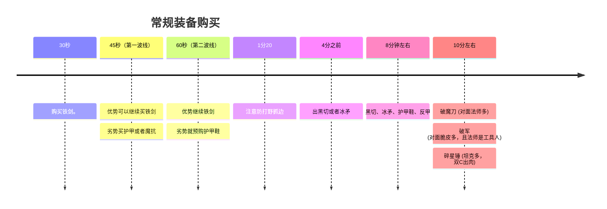
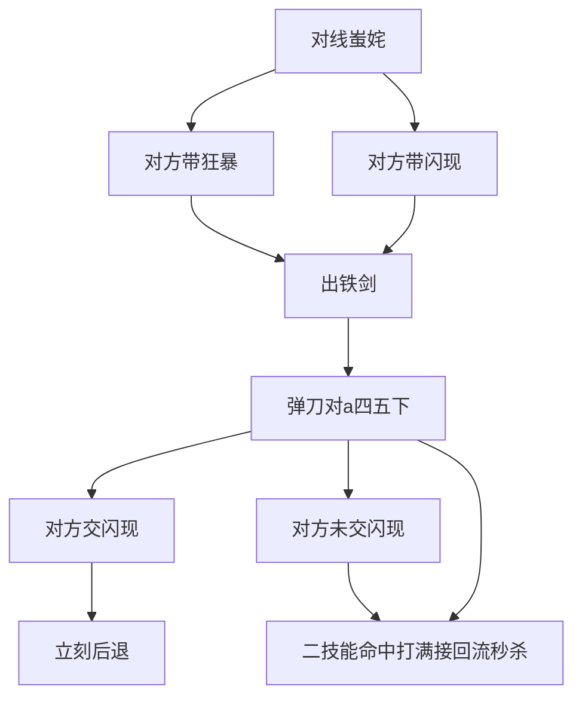
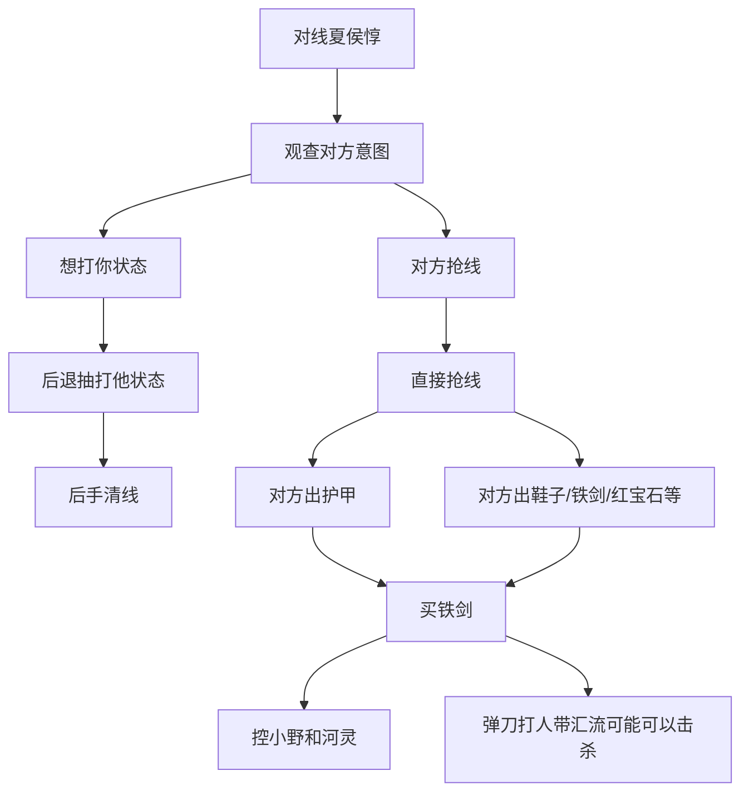
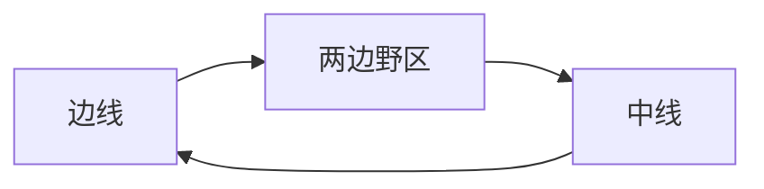

# [农活指南] - 从影开始

通篇以 ***边路影*** 作为例子，阐述从备战到作战。

英雄之间的差异在于 技能机制 与 面板属性。[但是在 S39 赛季的时候进行了全面修改，使得英雄的基础面板属性都发生了变化](https://pvp.qq.com/web201706/newsdetail.shtml?tid=624948)。这就使得相同定位的角色在开局时的属性相差并不大。

## 技能

不讲具体数值，只关注技能的机制。

<table>
  <thead>
    <tr>
      <th>技能</th>
      <th>技能图标</th>
      <th>技能描述</th>
    </tr>
  </thead>
  <tbody>
    <tr>
      <td>被动</td>
      <td>
        
      </td>
      <td>攻击较远的敌人会丢飞刃（远程形态），每次普通攻击会叠加 二技能印记</td>
    </tr>
    <tr>
      <td>一技能</td>
      <td>
        
      </td>
      <td>对附近敌人造成伤害和减速，并且增加自身攻速和移速。</td>
    </tr>
    <tr>
      <td>二技能</td>
      <td>
        
      </td>
      <td>
        向着指定方向突进（对敌人造成碰撞效果同时激发被碰撞目标印记造成伤害，并且传递印记给后方英雄），指定方向有人则释放矩形范围的飞刃攻击，造成伤害的同时会回复自身血量。
      </td>
    </tr>
    <tr>
      <td>三技能</td>
      <td>
        
      </td>
      <td>
        - 主动： 对附近敌人造成伤害，获得持续衰减的移速并且获得 4秒
        的暂时生命（假血） 
        - 被动： 没有进入cd中， 可以复活并对周围造成伤害。
      </td>
    </tr>
  </tbody>
</table>

### 技能细节

1. 弹刀：被动飞刃只有收回来才能进行下一次攻击， 在收回时进行攻击会触发弹刀， 会增加5%伤害和飞刃飞行速度， 上限3次。（详情技能有描述）
2. 二技能突进可以穿越峡谷中小厚度的墙体。
3. 三技能前期假血较少，可以在半血就开启防止掉状态（状态差，可能会被越塔）。

## 打法

核心是下面四件套

<table>
  <thead>
    <tr>
      <th>装备名称</th>
      <th>装备图标</th>
      <th>装备效果</th>
    </tr>
  </thead>
  <tbody>
    <tr>
      <td>冰矛 （寒霜袭侵）</td>
      <td>
        {" "}
        
      </td>
      <td>
        - +750最大生命;
        - +25%攻击速度; 
        - +70物理攻击;
        - 被动-寒霜:普攻和技能减少5~10%移速，持续1.5秒，可叠加2层;
        - 被动-冻伤:普攻和技能对目标额外造成135~270(+0.45额外Ad)物理伤害,冷却时间3秒;
      </td>
    </tr>
    <tr>
      <td>影忍之足</td>
      <td>
        {" "}
        
      </td>
      <td>
        - +50法术防御; 
        - +120物理防御; 
        - 唯一被动:+50移动速度(所有鞋类装备的移速加成效果不叠加); 
        - 唯一被动:抵挡6%-12%物理伤;
      </td>
    </tr>
    <tr>
      <td>暗影战斧</td>
      <td>
        {" "}
        
      </td>
      <td>
        - +80物理攻击; 
        - +10%冷却缩减; 
        - +500最大生命; 
        - 唯一被动-切割:增加90~180点物理穿透;
      </td>
    </tr>
    <tr>
      <td>反伤刺甲</td>
      <td>
        {" "}
        
      </td>
      <td>
        - +45物理攻击; 
        - +300物理防御; 
        - +700最大生命;
        - 被动-反刺:3秒内进入反刺状态，将受到的35%伤害以真实伤害回敬给对方，回敬伤害来源为抗性计算前(冷却时长:60秒);
      </td>
    </tr>
  </tbody>
</table>

import { Tab, Tabs } from "@rspress/core/theme";

<Tabs>
  <Tab label="脆皮多">
    <table>
      <thead>
        <tr>
          <th>装备名称</th>
          <th>装备图标</th>
          <th>装备效果</th>
        </tr>
      </thead>
      <tbody>
        <tr>
          <td>破军</td>
          <td>
            
          </td>
          <td>
            - +150物理攻击; 
            - +5%冷却缩减;
            - 唯一被动-破军:对生命值低于50%的敌人造成额外30%的伤害;
          </td>
        </tr>
      </tbody>
    </table>
  </Tab>
  <Tab label="法师多">
    <table>
      <thead>
        <tr>
          <th>装备名称</th>
          <th>装备图标</th>
          <th>装备效果</th>
        </tr>
      </thead>
      <tbody>
        <tr>
          <td>破魔刀</td>
          <td>
            
          </td>
          <td>
            - +90物理攻击; 
            - +150法术防御; 
            - +600最大生命;
            - 唯一被动-破魔:获得(50%物理伤害)法术防御，最多不超过250点;
          </td>
        </tr>
      </tbody>
    </table>
  </Tab>
  <Tab label="前排多">
    <table>
      <thead>
        <tr>
          <th>装备名称</th>
          <th>装备图标</th>
          <th>装备效果</th>
        </tr>
      </thead>
      <tbody>
        <tr>
          <td>碎星锤</td>
          <td>
            
          </td>
          <td>
            - +90物理攻击;
            - +700最大生命;
            - +7.5%移动速度; 
            - 唯一被动-破甲:+30%物理穿透;
          </td>
        </tr>
      </tbody>
    </table>
  </Tab>
    <Tab label="控制多">
    <table>
      <thead>
        <tr>
          <th>装备名称</th>
          <th>装备图标</th>
          <th>装备效果</th>
        </tr>
      </thead>
      <tbody>
        <tr>
          <td>抵抗之靴</td>
          <td>
            
          </td>
          <td>
            - +50物理防御
            - +100法术防御
            - 被动-神速:+50移动速度(所有鞋类装备的移速加成效果不叠加)
            - 被动-坚韧:+25%韧性
          </td>
        </tr>
      </tbody>
    </table>
  </Tab>
    <Tab label="保命退场">
    <table>
      <thead>
        <tr>
          <th>装备名称</th>
          <th>装备图标</th>
          <th>装备效果</th>
        </tr>
      </thead>
      <tbody>
        <tr>
          <td>幽影袖箭</td>
          <td>
            
          </td>
          <td>
            - +40物理攻击
            - +20%攻击速度
            - +20%暴击率
            - +650最大生命
            - 主动-无踪:立刻进入隐身状态，隐身状态每0.5秒恢复110~220+6%隐身前3秒损失的血量并获得:0%加速，持续2.5秒(近战减半)，释放技能或普攻会立刻退出隐身状态，冷却时间:75秒
          </td>
        </tr>
      </tbody>
    </table>
    </Tab>
</Tabs>

<table>
  <thead>
    <tr>
      <th>铭文名称</th>
      <th>铭文图标</th>
      <th>铭文效果</th>
    </tr>
  </thead>
  <tbody>
    <tr>
      <td>异变</td>
      <td></td>
      <td>
        - 物理攻击+2.00 
        - 物理穿透+3.60
      </td>
    </tr>
    <tr>
      <td>隐匿</td>
      <td></td>
      <td>
        - 物理攻击+1.60 
        - 移速+1.00%
      </td>
    </tr>
    <tr>
      <td>鹰眼</td>
      <td></td>
      <td>
      - 物理攻击+0.90 
      - 物理穿透+6.40
      </td>
    </tr>
  </tbody>
</table>

### 传送影

核心：

1. （冰矛）自从冰矛更新后，冰矛的技能机制被修改，使得技能也能触发减速留人。这就使得它成了边路影的核心装备。
2. （传送）边路影的发育环境相对较差，传送可以更快地支援队友，也能更快地回到线上发育。

选择情况：

1. 对面脆皮较多。
2. 对位坦边（ 难以单杀 ）。
3. 整体分段过低（ 1800以下 ），打不过可以带线牵制。

### 闪现影

核心：

1. （闪现）闪现可以提供更强的机动性，能让影在线上通过手法对位单杀，也能在团战中更灵活地切入和撤退。

选择情况：

1. 对位战刺，有手法操作的可能。
2. 团战对面双C自保较多的。
3. 整体分段较高（ 1800以上 ），对方手法意识较好。

### 汇流影

核心：

1. （汇流） 汇流可以提供超高的斩杀伤害， 通过 213 + 回流造成高额伤害，对手几乎反应不过来。

选择情况：

1. 可以处理平时打不过的英雄（司空震），也可以处理一些开局不做肉的坦边
2. 双C机动性一般。

## BP

BP 方面主要注意几个英雄：

1. 牢大（司空震）： 司空震的被动机制使得他在对线期非常强势， 被动护盾可以抵挡影的平a， 一技能唯一则可以躲避影的核心输出二技能
2. 铠： 大招格挡机制过于克制 影的二技能输出，在开大期间只能跑路。
3. 云樱： 改版之后非常灵活， 二层枪意的回复和一层枪意的护盾可以抵挡影的技能输出，平a也完全不虚影。
4. 女娲： 技能生成的墙体和控制，使得切入非常困难。

### BP 细节

1. 五排位置选择：作为对抗路，尽量在五号位，因为对线克制关系非常明显
2. 分析队友： 队友打野如果是【带线野（韩信）】、【大乔】，那么可以考虑带回流和闪现操作对手

::: tip
BP 指的是 Ban(禁用)和 Pick(选取)，也就是点击进入游戏后双方 禁用 和 选取英雄的阶段。
:::

## 对局公式

### 1. 装备思路

### 2. 开局对线思路

- 战边

::: info
蚩姹是典型战边学会开局查看面板信息，对方 3400-3600 那就是百穿铭文， 4500左右就是 肉铭文。

回流影 可以击杀 4000血以下的英雄。
传送影 可以击杀 3400血以下的英雄。
:::

- 坦边

### 3. 对线技巧

| 技巧名称     | 做法                     | 效果                                                     |
| ------------ | ------------------------ | -------------------------------------------------------- |
| 截线（断线） | 越过防御塔提前清理兵线   | 提早支援（对位要处理兵线，形成以多打少）                 |
| 卡线         | 不推兵线，让兵线自己推进 | 对手无法吃兵线（失去经济）；吃线就可以打状态甚至击杀对方 |
| 带远端线|里队友最远的一路兵线|给对手兵线压力|
### 4. 四分钟龙团以后（中后期）

这是影的强势期，凭借大招可以尝试对抗除了铠以外的绝大部分英雄。

带远端线，多截线然后支援保证经济，不能支援就刷和蹭线！

