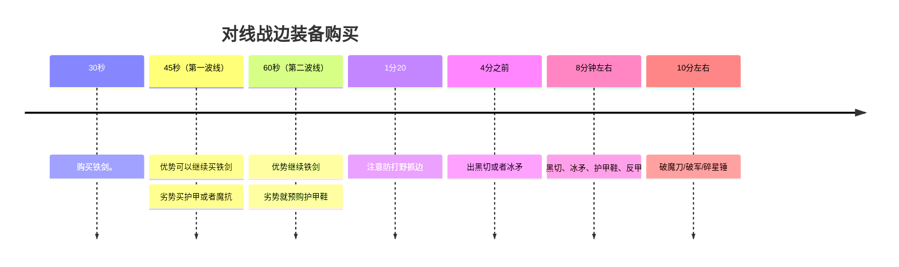

# 农活指南 - （备战）装备、铭文与召唤师技能

通篇以 影 作为例子，阐述如何备战。

英雄之间的差异在于 技能机制 与 面板属性。[但是在 S39 赛季的时候进行了全面修改，使得英雄的基础面板属性都发生了变化](https://pvp.qq.com/web201706/newsdetail.shtml?tid=624948)。这就使得相同定位的角色在开局时的属性相差并不大。

## 技能

不讲具体数值，只关注技能的机制。

<table>
  <thead>
    <tr>
      <th>技能</th>
      <th>技能图标</th>
      <th>技能描述</th>
    </tr>
  </thead>
  <tbody>
    <tr>
      <td>被动</td>
      <td>
        
      </td>
      <td>攻击较远的敌人会丢飞刃（远程形态），每次普通攻击会叠加 二技能印记</td>
    </tr>
    <tr>
      <td>一技能</td>
      <td>
        
      </td>
      <td>对附近敌人造成伤害和减速，并且增加自身攻速和移速。</td>
    </tr>
    <tr>
      <td>二技能</td>
      <td>
        
      </td>
      <td>
        向着指定方向突进（对敌人造成碰撞效果同时激发被碰撞目标印记造成伤害，并且传递印记给后方英雄），指定方向有人则释放矩形范围的飞刃攻击，造成伤害的同时会回复自身血量。
      </td>
    </tr>
    <tr>
      <td>三技能</td>
      <td>
        
      </td>
      <td>
        - 主动： 对附近敌人造成伤害，获得持续衰减的移速并且获得 4秒
        的暂时生命（假血） 
        - 被动： 没有进入cd中， 可以复活并对周围造成伤害。
      </td>
    </tr>
  </tbody>
</table>

### 技能细节

1. 弹刀：被动飞刃只有收回来才能进行下一次攻击， 在收回时进行攻击会触发弹刀， 会增加5%伤害和飞刃飞行速度， 上限3次。（详情技能有描述）
2. 二技能突进可以穿越峡谷中小厚度的墙体。
3. 三技能前期假血较少，可以在半血就开启防止掉状态（状态差，可能会被越塔）。

## 打法

import { Tab, Tabs } from "@rspress/core/theme";

<Tabs>
  <Tab label="传送影">
  <table>
    <thead>
      <tr>
        <th>冰矛</th>
        <th>护甲鞋</th>
        <th>黑切</th>
        <th>反甲</th>
        <th>破魔刀</th>
        <th>破军</th>
      </tr>
    </thead>
    <tbody> 
      <tr>
        <td></td>
        <td></td>
        <td></td>
        <td></td>
        <td></td>
        <td></td>
      </tr>
    </tbody>
  </table>

  <table>
    <thead>
      <tr>
        <th>隐匿</th>
        <th>异变</th>
        <th>鹰眼</th>
      </tr>
    </thead>
    <tbody>
      <tr>
        <td></td>
        <td></td>
        <td></td>
      </tr>
    </tbody>
  </table>
  </Tab>
  <Tab label="Tab 2">Tab 2 content</Tab>
</Tabs>

### 传送影

核心：
1. （冰矛）自从冰矛更新后，冰矛的技能机制被修改，使得技能也能触发减速留人。这就使得它成了边路影的核心装备。
2. （传送）边路影的发育环境相对较差，传送可以更快地支援队友，也能更快地回到线上发育。

选择情况： 
1. 对面脆皮较多。
2. 对位坦边（ 难以单杀 ）。
3. 整体分段过低（ 1800以下 ），打不过可以带线牵制。

### 闪现影

核心：
1. （闪现）闪现可以提供更强的机动性，能让影在线上通过手法对位单杀，也能在团战中更灵活地切入和撤退。

选择情况：
1. 对位战刺，有手法操作的可能。
2. 团战对面双C自保较多的。
3. 整体分段较高（ 1800以上 ），对方手法意识较好。

### 汇流影 
核心：
1. （汇流） 汇流可以提供超高的斩杀伤害， 通过 213 + 回流造成高额伤害，对手几乎反应不过来。

选择情况：
1. 可以处理平时打不过的英雄（司空震），也可以处理一些开局不做肉的坦边
2. 双C机动性一般。

## BP

BP 方面主要注意几个英雄：
1. 牢大（司空震）： 司空震的被动机制使得他在对线期非常强势， 被动护盾可以抵挡影的平a， 一技能唯一则可以躲避影的核心输出二技能
2. 铠： 大招格挡机制过于克制 影的二技能输出，在开大期间只能跑路。
3. 云樱： 改版之后非常灵活， 二层枪意的回复和一层枪意的护盾可以抵挡影的技能输出，平a也完全不虚影。
4. 女娲： 技能生成的墙体和控制，使得切入非常困难。

### BP 细节
1. 五排位置选择：作为对抗路，尽量在五号位，因为对线克制关系非常明显
2. 分析队友： 队友打野如果是【带线野（韩信）】、【大乔】，那么可以考虑带回流和闪现操作对手

## 对局公式

### 对线战边 

