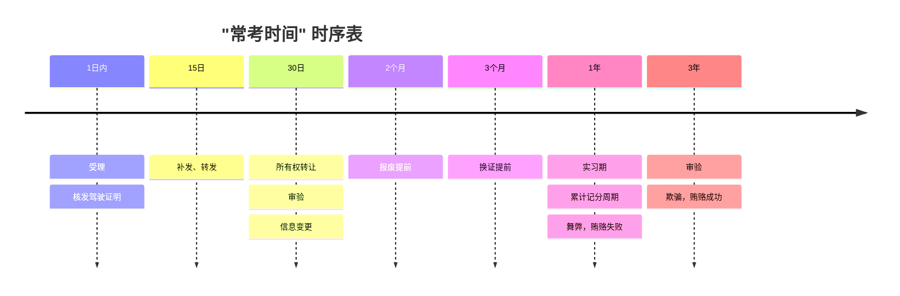

---
tags:
  - 生活
---

# 科目一

## 常规速记

### 1. 口五站三

- `口五`：离路口 `50米` 内不允许停车
- `站三`：里 XX 站台 `30米` 内不允许停车

### 2. 车登记、人核发

- `车登记`：和车相关的问题找车辆登记地
- `人核发`：和人相关的问题找核发地（即通过驾驶证考试后，发放驾驶证的车管所）

### 3. 假一吊二撤三醉五逃终生

- `假一`：提供虚假材料，一年内不得报考
- `吊二`：吊销驾驶证后，两年内不得报考
- `撤三`：被撤销驾驶证后，三年内不得报考
- `醉五`：醉驾吊销驾照后，五年内不得报考
- `逃终生`：交通事故后逃逸，众生不得报考

:::tip

酒驾营运车 与 醉驾吊销驾驶证，五年内不得重新取得驾驶证。

醉驾营运车，属刑事责任，十年内不得重新取得驾驶证。

:::

### 4. 高速车道限速：2 车道，3 车道

- `2车道`：左——100——120，右——60——100
- `3车道`：左——110-120，中——90——110，右侧——60——90

### 5. 警告标识放置距离：高 150 以外、普 50 至 100

- `高150以外`：在高速公路来车方向的 150 米以外防止安全警告标志
- `普50至100`：在高速公路来车方向的 50 米至 100 米之间放置安全警告标志

### 6. 城市、公路限速：城市 35、公路 47

- `城市35`：
  - 在城市道路 `无中心线` 时限速为 30 km/h
  - 在城市道路 `有中心线` 时限速为 50 km/h
- `公路47`：
  - 在高速公路 `无中心线` 时限速为 40 km/h
  - 在高速公路 `有中心线` 时限速为 70 km/h

### 7. 减分政策：公益 111、网上 331、现场 112

- `公益111`：学习满 1 小时为 1 次， 一次扣减 1 分
- `网上331`：学习 3 日内，满 30 分钟，一次扣减 1 分
- `现场112`：现场学习满 1 小时为 1 次， 一次扣减 2 分

### 8. 初次申领：客挂不可初次申领

大客车、中客车、牵引车不可以初次申领，只能通过增驾取得

### 9. 上路行驶：2 证、2 标、1 号牌

- `2证`：
  - 机动车驾驶证
  - 机动车行驶证
- `2标`：
  - 保险标志
  - 检验合格标志
- `1号牌`：
  - 机动车号牌

### 10. 手动挡踏板：离、制、加

- `离`：离合踏板
- `制`：制动踏板
- `加`：加速踏板

:::tip

C2 自动档没有离合踏板！

C2 左脚不踩踏板！

:::

### 11. 漫水路安全行使

通过漫水路时应做到：**一停、二看、三通过**

### 12. 道路虚线实线：虚可跨、实不跨

- `虚可跨`：道路行驶，看到虚线可以通过
- `实不跨`：道路行驶，看到实线不可以通过

### 13. 限速 30

通过 `铁路道口`、`急转弯路`、`窄道窄桥`、`掉头转弯`、`下陡坡`、`雾雨雪尘冰` 等情况，限速 30 km/h

### 14. 重大事故责任判定 3 以下、3 至 7、7 以上

- `3以下`：致人重伤、死亡、重大财产损失
- `3至7`：致人死亡且逃逸、逃逸或者其他恶劣情节
- `7以上`：逃逸后致人死亡

:::danger

判七年以上的前提是逃逸，且导致当事人死亡，如果是当场死亡然后再逃逸，则属于判三年至七年

:::

15. 交通事故责任判定

**_人无错，车担责；人故意，车减责；车无错，担小责_**

- `人无错，车担责`：行人没有过错的，由机动车承担赔偿责任
- `人故意，车减责`：有证据表明行人故意的，根据过错程度适当减轻机动车的赔偿责任
- `车无错`：机动车没有过错的，承担不超过 10% 的赔偿责任

### 16. 常考时间

### 17. 常考罚款题

- 虚假材料：500
- 弄虚作假：1000
- 贿赂舞弊：2000
- 伪造变造：2000-5000
- 饮酒醉酒：1000-2000
- 逾期：200-500
- 补领：20-200
- 组织他人代审：
  - 有违法所得：3 倍不超过 2 万
  - 无违法所得：2 万以下
- 组织他人代罚：3 倍不超过 5 万

:::info

代审是指，一个人代另一个人去参加法定考试，例如 机动车驾驶证审验考试

:::

### 18. 英文缩写

| 名称             | 缩写 | 意象                          |
| ---------------- | ---- | ----------------------------- |
| 自适应巡航控制   | ACC  | 巡字右边 《 像 cc             |
| 定速巡航         | CCS  | 巡字左边 《 像 cc，速找 S     |
| 交通标志识别系统 | TSR  | 交通标志太多 “太伤人”         |
| 盲点检测系统     | BSD  | 站在盲点 “必死的”             |
| 辅助盲点         | BSA  |                               |
| 车身稳定控制系统 | ESP  | 车在原地“原地不动”            |
| 车道偏离预警系统 | LDW  | 车道歪了找 W                  |
| 电子制动力系统   | EBD  | 刹车找 E 电子后面找 D         |
| 紧急制动辅助系统 | EBA  | 急刹找 E 紧急 A 在后          |
| 自动刹车辅助系统 | ABS  | 刹车找 E 自动 A 在前 （auto） |

## 交通手势

### 1. 停止

当交警左手五指并拢，并且高举过头顶时，代表停止

<iframe
  style={{ width: "100%", height: "50rem" }}
  src="//player.bilibili.com/player.html?isOutside=true&aid=356032786&bvid=BV1DX4y1y7ei&cid=1128204974&p=1"
></iframe>

### 2.

## 三超问题

import { Tab, Tabs } from "rspress/theme";

<Tabs>
  <Tab label="超员">

| 车型                                        | 情况     | 扣分 |
| ------------------------------------------- | -------- | ---- |
| **校客旅** （校车、公路客运车、旅游客运车） | 未达 20% | 6    |
| **七座以下**                                | 20%—50%  | 3    |
|                                             | 50%—100% | 6    |
|                                             | 100%以上 | 12   |
| **七座以上**                                | 20%—50%  | 6    |
|                                             | 50%—100% | 9    |
|                                             | 100%以上 | 12   |

**_口诀：下 36 上 69，看到以上扣 12_**

  </Tab>
  <Tab label="超速">
| 车型                                       | 公路类型                | 情况                            | 扣分     |
| ----- | ------- | ---------------- | ---- |
| **普通车**                                 | 普通公路  | 20%—50%  20%—50% 50%以上 | 3  |
||普通公路|50%以上|6|
||高速路、快速路|6|
||高速路、快速路|12|
| **中校危**（中型客车、校车、危险品运输车） | 普通公路                |                                 |
||||
  </Tab>
    <Tab label="超载" >

  </Tab>
</Tabs>

## 扣分题

### 扣一分

***带检禁规掉***

- 带：未系安全带
- 检：未按规定进行年检
- 禁：违反禁令标志、违反禁止标线
- 规：不按规定会车、不按规定使用灯光
- 掉：普通公路不按规定倒车掉头

:::info

禁令标志：白底、红圈、红杠、黑图案。

禁止标线：道路上的 黄实线、白实线、黄大叉

:::

### 扣三分

***让电逆告规低事***

- 让：不避让行人
- 电：拨打接听电话
- 逆：普通公路逆行
- 告：未设置警告标志
- 规：不按规定车道行驶，不按规定安装号牌
- 低：高速公路行驶低于最低时速
- 事：事故后不按规定使用灯光

### 扣六分

- 信：违反交通信号灯
- 占：违法占用应急车道
- 微：致人轻伤或财产损失逃逸
- 示：未设置警示标志

### 扣九分

- 遮：遮挡、污损号牌
- 牌：未悬挂号牌
- 符：驾驶车辆与准假车型不符合
- 停：高速公路违法停车

### 扣十二分

- 伪：伪造变造驾驶证、号牌
- 酒：饮酒、醉酒开车
- 倒：高速公路倒车逆行
- 伤：致人轻伤以上或死亡逃逸
- 卖：卖分谋取经济利益